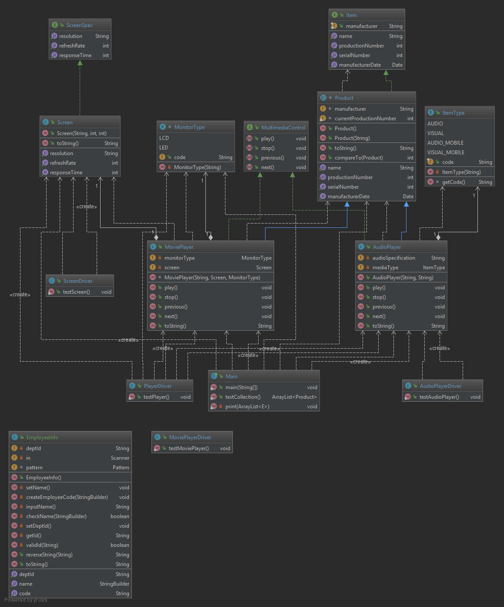

# JP_Project

## Documentation

[JavaDocs]((https://EHoffman1.github.io/JP_Project/docs/index.html)

## Class Diagram

## Getting Started
In order to run the program, either download the zip of this repository, or download all the files in the src. Once downloaded, open up IntelliJ or any similar IDE and create a new project with the zip or downloaded src files. You can then run the main class which will test the classes of the program.

## Built With

*	IntelliJ IDEA was used for the development environment.
* Java JDK 1.8

## Author

* Eric Hoffman

## Installation

*	To install IntelliJ IDEA, you will need to go to the jetbrains website and download the ultimate edition. After downloading, install it to your computer and run it when it’s done. Once running you will need to make an account and hopefully you have a way to get the ultimate for free, or else it will cost money after the free trial. 

## License

## Acknowledgements

* Professor Vanselow
* Allen Telson
* Oracle Academy
* Google Style Guides

